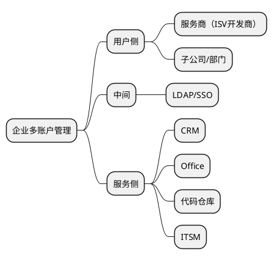

在深入讨论多账户管理时，我们可以使用PlantUML来绘制一个脑图，清晰地呈现企业多账户管理的关系，以及可选的方案。以下是一个简要的示例：

在这个脑图中，我们展示了企业多账户管理的两个主要侧面：用户侧和服务侧。用户侧涵盖了企业对接服务商、子公司、部门等不同角色的多账户管理需求。服务侧列举了企业客户或互联网企业可能需要对接的一些服务，如CRM、Office、代码仓库、ITSM等。

以下是关于可选方案的描述：

开源方案： 使用开源的身份和访问管理解决方案，如Keycloak、Dex等，可以根据企业需求自定义账户体系，提供多账户管理、角色权限等功能。这样的方案通常需要企业自行部署和维护。

商业方案： 考虑购买商业身份认证和授权解决方案，如Okta、OneLogin等，这些方案提供了更多高级功能，可集成多种服务，支持定制化和多账户管理需求。

云上服务： 利用云厂商提供的身份认证和授权服务，如AWS Cognito、Azure Active Directory、Auth0等，可以快速构建并管理多账户体系，无需自行部署和维护。

混合方案： 根据实际需求，可能会采用混合的方案。例如，使用开源解决方案自行部署用户侧的多账户管理，同时利用云上服务来集成服务侧的多账户管理，以满足不同需求。

当使用表格来从不同角度对比可选方案时，您可以创建一个如下所示的表格来清晰地展示这些方面的比较：

方案	人力成本	商业服务成本	可用性	性能
开源方案	中等（需要自行配置、维护）	低（无需购买许可）	根据部署配置而定	取决于服务器硬件和配置
商业方案	低（提供商业支持）	高（购买许可费用）	高（通常有SLA保障）	优秀（专业优化）
云上服务	低（简化部署和维护）	中等（按使用量计费）	高（通常有高可用性）	优秀（云基础设施）
混合方案	中等（根据自定义程度）	中等（根据选择）	根据部署配置而定	优秀（云基础设施）
在上述表格中，我们从人力成本、商业服务成本、可用性和性能等角度对比了不同方案。每个方案在这些方面都有不同的优劣势，您可以根据企业的实际情况和需求来进行权衡和选择。请注意，这只是一个简单的比较，实际情况可能因企业规模、技术栈、预算和安全需求而异。

无论选择哪种方案，都需要根据企业的具体情况、安全性要求以及预算等因素来进行权衡和决策。通过明晰的多账户管理体系，企业可以更好地管理不同角色的访问权限，提升安全性和管理效率。
