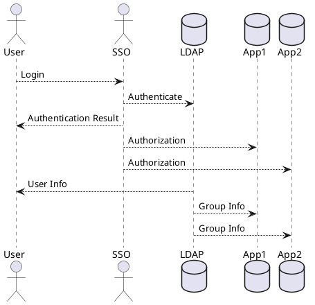

结合LDAP/SSO来管理用户与组是构建有效账户体系的重要一环。LDAP（轻量级目录访问协议）提供了一种组织用户、组和权限等信息的标准协议，而SSO（单点登录）使用户能够通过一次登录访问多个应用。以下是如何结合LDAP/SSO来管理用户与组的基本流程：

定义组织结构和架构： 在LDAP中，您需要定义组织的层次结构。这包括创建顶级组织、部门、团队等。这样的组织结构可以反映您企业内部的实际组织架构。

创建用户账户： 将用户账户添加到适当的组织中。用户的账户信息（如用户名、密码、电子邮件等）将存储在LDAP中。此外，您可以为每个用户分配唯一的标识符，例如LDAP中的DN（Distinguished Name）。

定义组和权限： 创建不同类型的组，如部门、权限组等。每个组可以包含一组用户，用于管理特定权限。LDAP中的组可以用来管理访问权限，例如将用户添加到某个组以获得特定资源的访问权限。

配置SSO： 集成SSO解决方案，允许用户通过一次登录访问多个应用。用户在登录时通过SSO认证，然后系统会使用LDAP中的用户信息来授权其访问特定应用和资源。

映射用户与组： 在SSO中，您可以设置用户和组的映射关系。这意味着当用户登录时，系统会检查其在LDAP中的组织结构和权限，并根据配置的映射关系来决定其在各个应用中的角色和权限。

管理用户与组关系： 随着企业发展，用户可能加入新部门、转移至其他团队，或需要不同的权限。在LDAP中更新用户信息和组关系，确保用户能够正确地访问资源。

审计和监控： 监控用户和组的活动，确保账户体系的安全性。及时识别异常活动，以及管理用户的访问权限。

总之，通过结合LDAP/SSO来管理用户与组，您可以建立起安全、灵活的账户体系，允许用户按照组织架构和角色访问资源，同时提升用户体验和管理效率。要注意的是，实施这一过程需要根据具体的技术栈、企业需求和安全性要求进行配置和定制。

在这个示意图中，我们展示了一个简化的LDAP/SSO管理用户与组的过程：

用户通过登录界面登录（Login）。
SSO进行身份验证（Authenticate）并与LDAP交互验证用户信息。
SSO将认证结果返回给用户（Authentication Result）。
SSO根据用户的权限将授权信息传递给App1和App2（Authorization）。
LDAP向用户提供用户信息（User Info）以及组信息（Group Info）。
App1和App2根据LDAP提供的组信息，为用户分配适当的角色和权限。
请注意，这个示意图仅用于说明基本的流程，实际的LDAP/SSO配置和交互可能会更加复杂。您可以根据实际情况和需求对图进行调整和扩展，以反映更详细的用户与组管理流程。

使用开源软件Keycloak和OpenLDAP来管理分组、对接云服务账号（使用SAML协议）以及对接各类服务账号（使用OIDC协议）是构建综合身份认证和授权解决方案的一部分。下面是一些关于这些方面的简要说明：

管理分组
在Keycloak中管理分组可以实现用户分类和权限分配。您可以按照以下步骤进行：

在Keycloak中创建Realm（领域）并配置LDAP身份验证，将Keycloak与OpenLDAP连接起来。
在Realm中创建Group（分组），例如部门、团队等。
将用户添加到不同的分组中，从而为用户分配特定的权限和角色。
对接云服务账号（使用SAML协议）
使用SAML（安全断言标记语言）协议对接云服务账号，例如对接云厂商的身份认证服务（如Azure Active Directory、Okta等），可以按照以下步骤：

在Keycloak中创建SAML身份提供者，配置与云服务提供商的信任关系。
在云服务提供商中配置SAML单点登录，将其与Keycloak建立信任关系。
将Keycloak中的用户和分组与云服务中的用户和角色进行映射。
对接各类服务账号（使用OIDC协议）
使用OIDC（开放ID连接）协议对接各类服务账号，可以使用户在不同应用中实现单点登录和身份验证，例如对接开源软件、商业应用等。以下是大致步骤：

在Keycloak中创建OIDC客户端，以便将您的应用连接到Keycloak。
配置客户端，指定要使用的协议（OIDC）以及要与之集成的服务端点和身份提供者。
配置用户分组和角色，以便将Keycloak中的用户与特定的应用角色映射。
总之，使用Keycloak和OpenLDAP可以构建强大的身份认证和授权体系，使您能够管理用户、分组和权限，以及与不同类型的应用和云服务进行集成。要注意，每个具体的对接步骤可能会涉及多个细节设置，根据您的实际情况进行调整和配置
